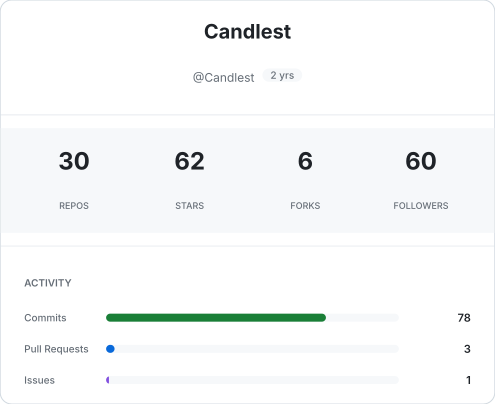
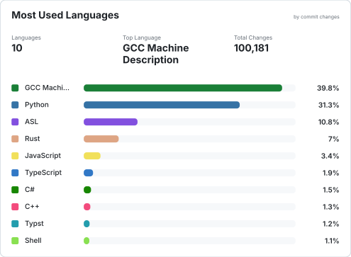
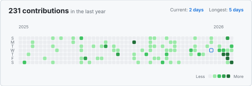
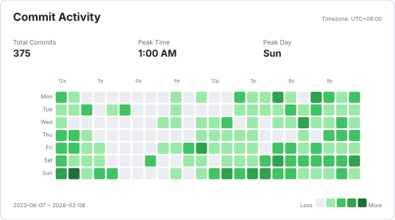

  
  
  

 

### 🌸 Focus & Interests

` Security ` &nbsp; CTF basics · binary security (beginner)  
` Systems  ` &nbsp; Linux · Docker · Kubernetes · telemetry  
` Develop  ` &nbsp; Rust · Go · Vue.js · Modding (C# · JS)  
` AI Tech  ` &nbsp; VLA · agent × kernel · data generation  

  

 

### 🏗️ Background

` Builder  ` &nbsp; 2013–2024 · Qt · WinForms · CEF · Linux  
` Legacy   ` &nbsp; Pre-uni explorations · personal tools · GUI widgets  

  

 

### ✍️ Writing & Social

` Writing  ` &nbsp; [Blog](https://blog.candlest.cc) · technical notes · reproducible quality  
` Presence ` &nbsp; [Zhihu](https://www.zhihu.com/people/candlest) · [小红书](https://www.xiaohongshu.com/user/profile/62a4ea3d0000000021022482) · [Bilibili](https://space.bilibili.com/1736232402) · [Bangumi](https://bgm.tv/user/candlest)

 

### 📊 Activity

  
  

  

  

 

  

