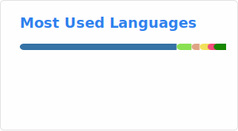

  
  
  

我是 Candlest，你也可以叫我水蜡烛。

在中山大学网络空间安全专业大二就读，常驻广州 / 深圳。

ALL IN Embodied Intelligence， 空闲时间开发、打 CTF。

  

## 其他平台

- [Blog](https://blog.candlest.cc)
- [数字名片](https://candlest.cc)
- [SYSU-ReMajor](https://sysu-remajor.github.io)
- [Zhihu](https://www.zhihu.com/people/candlest)
- [Bilibili](https://space.bilibili.com/1736232402)
- [Bangumi](https://bgm.tv/user/candlest)

## Activity

  
  

  

